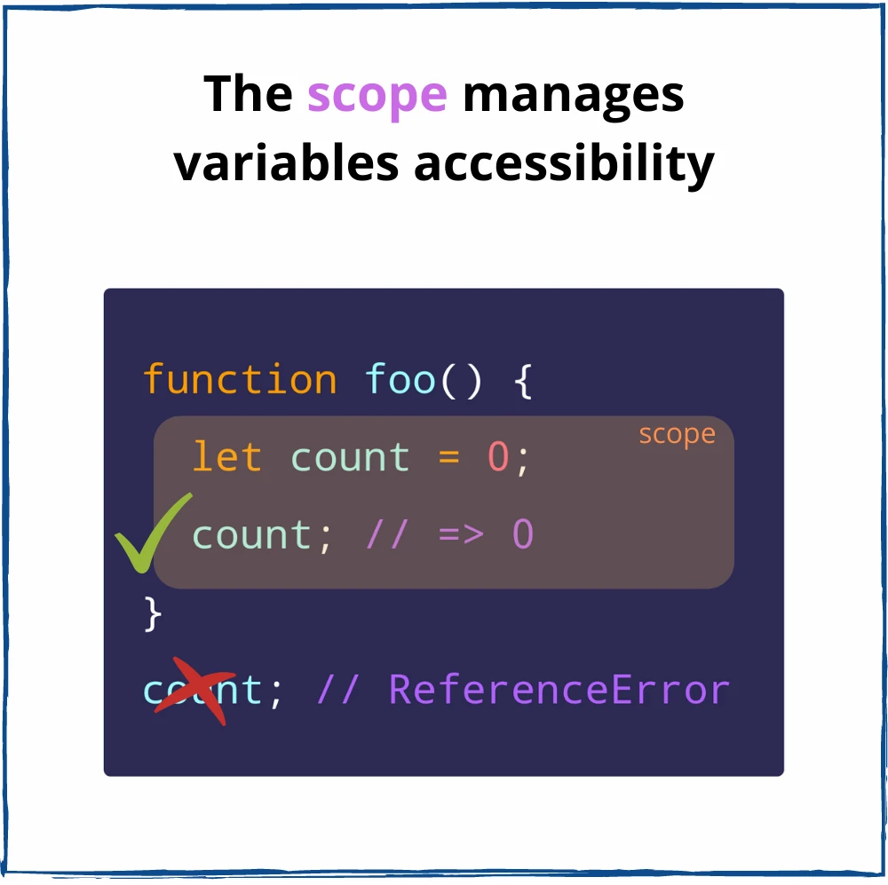
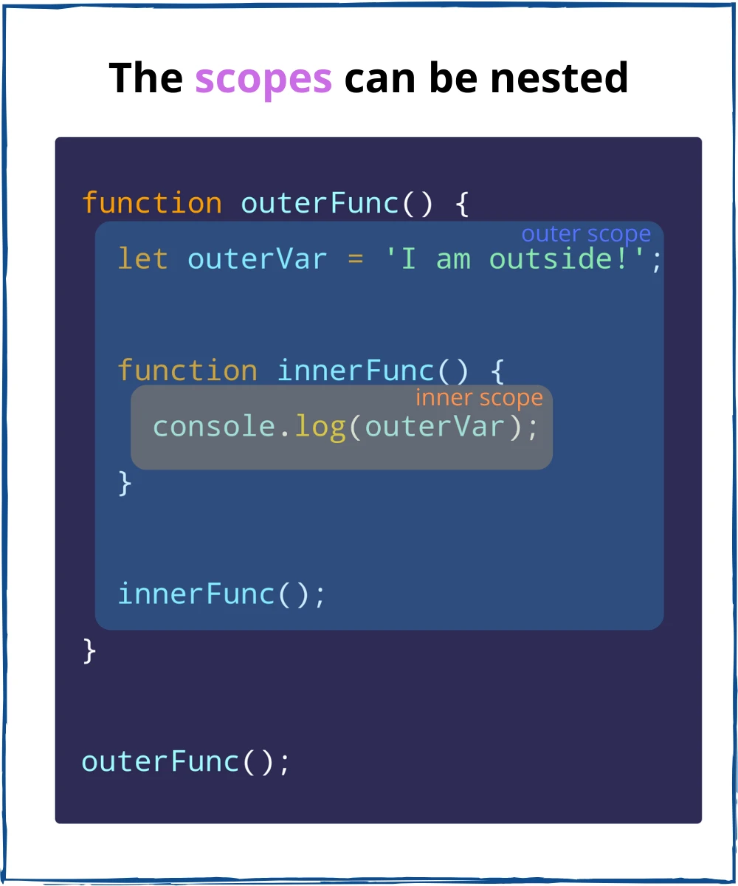
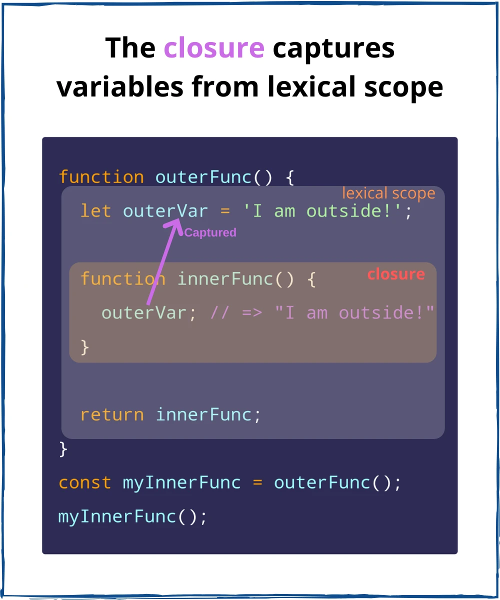

# Closures

Javascript is a synchronous language
When our thread of execution is going line by line saving variables and function definitions to global memory, we will eventually  (maybe) reach a line that executes a function
When we execute that function Javascript creates an execution context specifically to run that function
Inside of that execution context there's a local memory... that local memory, when its done being used isn't deleted or collected by the garbage collector it is packaged away and carried by the return statement


----

[Closure](https://dev.to/papercoding22/how-to-explain-javascript-closure-to-a-5-years-old-kid-4d6n) is like a candy factory
You send the factory an order to make candies for you with your favorite flavor
The factory will pick the right expert for you,
And it send back to you an expert's contact
Now whenever you need, you just call and submit the quantity
That expert will take care all the rest for you

```js
const candyFacaotry = (flavor) => {
  const experts = {
    Chocolate: {
      name: 'Tim',
      secretRecipe: 'choco'
    },
    Strawberry: {
      name: 'Alex',
      secretRecipe: 'berry'
    }
  }

  const expertByFlavor = experts[flavor];
  return (quantity) => {
    return `${quantity} ${flavor} candies are made by ${expertByFlavor}.`
  }
}
```

The factory doesn't want to send you their experts,
Because it may leak their top secret recipe

Instead, they just send you a way to call the expert (as a function)
and waiting for your call to order anytime

Now the factory keeps your flavor and your expert

In conclusion:
Only the inner function can access outer function's scope
Only the factory can directly tell the expert what to do

```js
const chocolateExpert = candyFactory('Chocolate');
const strawberryExpert = candyFactory('Strawberry');

console.log(chocolateExpert(1000));
// 1000 chocolate candies are made by Time

console.log(stawberryExpert(500));
// 500 strawberry candies are made by Alex
```

<hr>

The **`callbacks`**, **`event handlers`**, **`higher-order functions`** can access **outer scope variables** thanks to *`closures`*

You need to understand the fundamental terms: **`scope`** and **`lexical scope`**
Then, after grasping the basics, you'll need just one step to finally understand closures

1. The Scope
   
    When you define a variable, you want it accessible within some boundaries
    
    For example, a `result` variable... it makes sense to want it within a `calculate()` function, as an internal detail
  
    Outside of the `calculate()` function, the `result` variable is inaccessible
  
    **In JavaScript, a scope is created by a function or code block**
   
    Let's see how the scope affects the availability of a variable `count`.
    This variable belongs to a scope created by the function `foo():`
  
    ```js
    function foo() {
    // The Function foo
      let count = 0
      console.log(count)
    }

    foo();
    console.log(count); // referenceError: count is not defined
    ```
  
    `count` is freely accessed within the scope of `foo()`
   
    However, outside of the `foo()` scope, `count` is inaccessible.
    If you try to access `count` from outside anyways,
    Javascript throws `ReferenceError: count is not defined`

    In JavaScript, the scope says: 
    **If you've definde a variable inside of a function or code block,
    then you can use this variable only within that function or code block.**
    The above example demonstrates this behavior
    
    

    **The *`scope`* is a space policy that rules the accessibility of variables**

    An immediate property arises: the scope *isolates* variables.

    That's great because *different scopes can have variables with the same name*

    You can reuse common variable names (`count`, `index`, `current`, `value`, etc) in different scopes without collions
  
    `foo()` and `bar()` function scopes have their own, but same named, variables `count`:

    ```js
    function foo() {
    // The Function foo
      let count = 0
      console.log(count)
    }
  
    foo();
    console.log(count); // referenceError: count is not defined

   function bar() {
    // 'bar' function scope
    let count = 1
    console.log(count); // logs 1
   }
   
   foo();
   bar();
   ```
   `count` variables from `foo()` and `bar()` function scopes do not collide


2. Scopes nesting
     We need to play a little more with scopes... we can start by putting one scope inside another
    
     The Function `innerFunc()` is nested inside an outer function `outerFunc()`
     
     
     How would the 2 function scopes interact with each other ?
     Can I access the variable `outerFunc()` from within innerFunc() scope?
     Let's try that in the example:
     ```js
     function outerFunc() {
      // the outer scope
      let outerVar = 'I am Outside';
    
      function innerFunc() {
        // the inner scope
        console.log(outVar); // logs "I am outside"
      }
    
      innerFunc();
     }
     
     outerFunc();
     ```
     Indeed, `outerVar` variable is accessible inside `innerFunc()` scope.
     The variables of the outer scope are accessible inside the inner scope.
     
     Now you know 2 interesting things:
     
     - **Scopes can be nested**
     - **The variables of the outer scope are accessible inside the inner scope**

3. The Lexical Scope

     How does JavaScript understand that `outerVar`inside`innerFunc()`corresponds to the variable`outerVar`of`outerFunc()`?
     
     It's because JavaScript implements a scoping mechanism called ***`lexical scoping`***(also called **static scoping**)
     
     ***Lexical Scoping:*** means that the accessibility of variables is determined by the position of the variables in the source code inside the nesting scopes
     
     Simpler, ***Lexical Scoping*** means that inside the inner scope you can access variables of its outer scope
    
     It's called *`lexical`*(or *`static`*) because the engine determines the nesting of scopes just by looking at the JavaScript code, without executing it.
     
     Here's how the engine understands the previous code snippet
     
     1) I can see you define a function `outerFunc()` that has a variable `outerVal` - good
     2) Inside the `outerFunc()`, I can see you define a function `innerFunc()`
     3) Inside the `innerFunc()`, I can see a variable `outerVar` *without declaration.* Since I use lexical scoping, I consider the variable `outerVar` inside `innerFunc()` to be the same variable as `outerVar` of `outerFunc()`
 
     Another example:
     ```js
     
     const myGlobal = 0;
     
     function func() {
       const myVar = 1;
       console.log(myGlobal); // logs 0
     
       function innerOfFunc() {
         const myInnerVar = 2;
         console.log(myGlobal, myVar); // logs 0 1
     
         function innerOfInnerOfFunc() {
           console.log(myGlobal, myVar, myInnerVar); // logs 0 1 2
         }
     
         innerOfInnerOfFunc();
       }
     
       innerOfFunc();
     }
     
     func();
     ```
     
     
     The lexical scop of `innerOfInnnerOfFunc()` consists of `innerOfFunc()`, `func()` and global scope  (the outermos scope). Within `innerOfInnerOfFunc()` you can access the lexical scope variable  `myInnerVar`, `myVar` and `myGlobal`
     
     The lexical scope of `innerFunc()` consists of `func()` and global scope.
     Within `innerOfFunc()` you can access the lexical scope variables `myVar` and `myGlobal`
     
     Finally, the lexical scope of `func()` consists of only the global scope.
     Within `func()` you can access the lexical scope variable `myGlobal`

4. The Closure

    Ok, the lexical scope allows to access the variables statically of the outer scopes.
    There's just one step until the closure!

    Let's take a look again at the `outerFunc()` and `innerFunc()` example:

    ```js
    function outerFunc() [
      let outerVar = 'I am outside!';

      function innerFunc() {
        console.log(outerVar); // logs "I am outside!"
      }

      innerFunc();
    ]

    outerFunc();
    ```

    Inside the `innerFunc()` scope, the variable `outerVar` is accessed from the lexical scope.
    That's known already.

    Note that `innerFunc()` invocation happens inside its lexical scope (the scope of `outerFunc()`)

    Let's make a change: `innerFunc()` to be invoked outside of its lexical scope (outside of `outerFunc()`).

    Would `innerFunc()` still be able to access `outerVar`?

    Let's make the adjustments to the code snippet:

    ```js
    function outerFunc() {
      let outerVar = 'I am outside!';

      function innerFunc() {
        console.log(outerVar) // => "I am outside!"
      }

      return innerFunc;
    }

    const myInnerFunc = outerFunc();
    myInnerFunc()
    ```

    Now `innerFunc()` is executed  outside of its lexical scope. And what's important:

    `innerFunc()` *still has access to `outerVar` from its lexical scope, even being executed outside of its lexical scope*

    In other words, `innerFunc()` *closes over* (a.k.a captures, remembers) the variable `outerVar` from its *lexical scope*.

    In other words, `innerFunc()` is a *closure* because it closes over the variable `outerVar` from its lexical scope

    

    You've made the final step to understanding what a closure is:

    > *The closure* is a function that accesses its lexical scope even executed outside its lexical scope

    Simpler, the closure is a function that remembers the variables from the place where it is defined, regardless of where it is executed later.

    A rule of thumb to identify a closure: if you see in a function an alien variable (not defined inside the function), most likely that function because the alien variable is captured.

    In the previous code snippet, `outerVar` is an alien variable inside the closure `innerFunc()` captured from `outerFunc()` scope.

    Let's continue with examples that demonstrate why the closure is useful.

5. Closure examples
5.1 Event Handler

    Let's display how many times a button is clicked:

    ```js
    let countClicked = 0;

    myButton.addEventListener('click', function handleClick() {
    countClicked++;
    myText.innerText = `You clicked $(countClicked) times`;
    });
    ```

    [google](google.com) and click the button. The text updates to show the number of clicks

    When the button is clicked, `handleClick()` captures `countClicked` from the lexical scope and updates it when a click happens. Even more, `myText` is captured too...
5.2 Callbacks
    Capturing variables from the lexical scope is useful in callbacks

    A `setTimeout()` callback:

    ```js
    const message = 'Hello, World!';

    setTimeout(function callback() {
      console.log(message); // logs - "Hello, World!"
    }, 1000);
    ```
    
    The `callback()` is a closure because it captures the variable `message`.

    An iterator function for `forEach()`:

    ```js
    let countEven = 0;

    const items = [1, 5, 100, 10];

    items.forEach(function iterator(number){
      if (number % 2 === 0) {
        countEven++;
      }
    });

    countEven; // => 2
    ```

    The `iterator` is a closure because it captures `countEven` variable.
5.3 Functional programming
    Currying happens when a function returns another function until the arguments are fully supplied.

    For example:

    ```js
    function multiply(a){
      return function executeMultiply(b) {
        return a*b;
      }
    }

    const double = multiply(2);
    double(3); // => 6
    double(5); // => 10

    const triple = multiply(3);
    triple(4); // => 12
    ```

    `multiply` is a curried function that returns another function
    Currying, an important concept of functional programming, is also possible thanks to closures

    `executeMultiply(b)` is a closure that captures `a` from its lexical scope.
    When the closure is invoked, the captured variable `a` and the parameter `b` are used to calculate `a*b`.
    
6. Conclusion
The scope is what rules the accessibility of variables in JavaScript.
There can be a function or a block scope
The lexical scope allows a function scope to access statically the variables from the outer scopes
Finally, a closure is a function the captures variables from its lexical scope.
**In simple words, the closure remembers the variables from the place where it is defined, no matter where it is executed.**
Closures capture variables inside event handlers, callbacks. They're used in functional programming. Moreover, you could be asked how closures work during a Frontend Job Interview.
